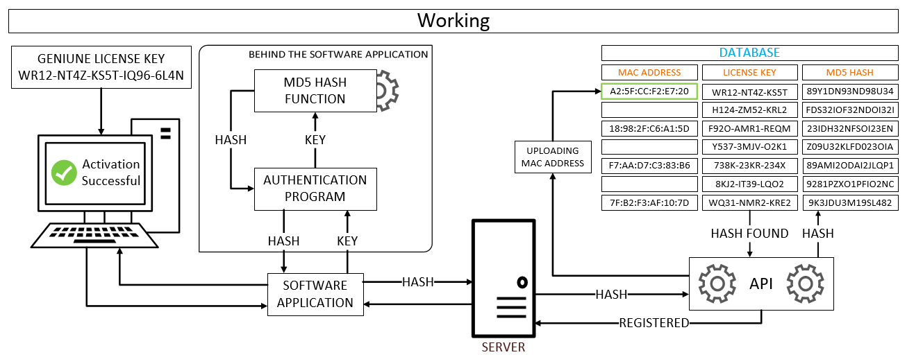
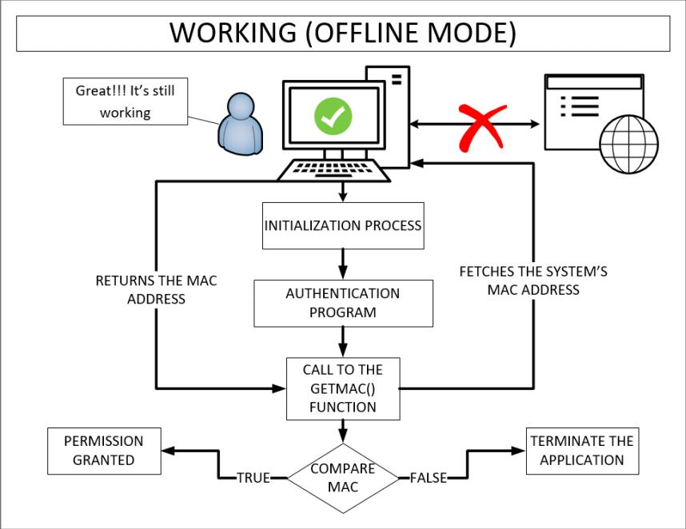
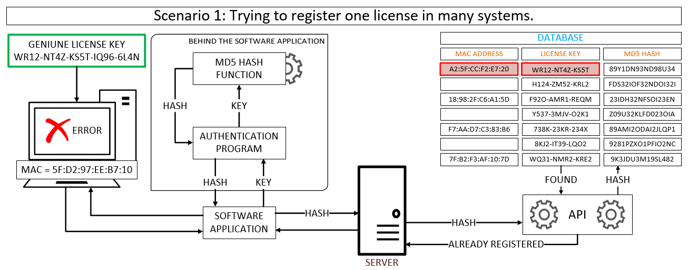
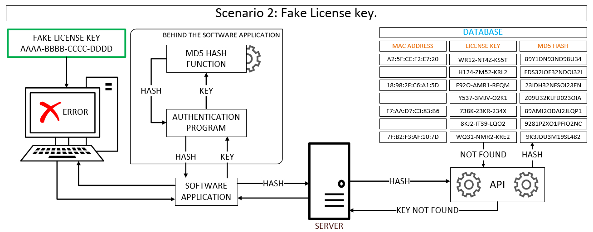

<html lang="en">
<head>
  <meta charset="UTF-8">
  <meta name="viewport" content="width=device-width, initial-scale=1.0">
  <title>Software Piracy Protection System</title>
  <h1>
Software Piracy Protection System
</h1>
</head>
<body>
<h3><u>Introduction</u></h3>

  The objective of this project is to prevent software piracy by embedding a methodology within the software application. The methodology includes the use of an authentication server for license key authorization and registration of the license key with its corresponding MAC address. The authentication server performs checks and registers the user's MAC address. This methodology is functional in offline mode and effectively prohibits counterfeit software applications from running on any other computer. Authentication and registration of the software application are conducted exclusively during the installation process. Subsequently, the MAC address is utilized for offline authentication, ensuring that the software application cannot be duplicated on any other computer.

<h3><u>How it Works</u></h3>

The proposed methodology is designed to prevent software piracy and can be seamlessly integrated into any software application. The methodology operates as follows:
 
During the installation process, an active internet connection is required to successfully complete the software installation.

Once the genuine license key is entered into the software application, it is passed to the authentication program. The license key is then encrypted using the MD5 hash function to protect it over the internet. The encrypted hash is then returned to the software application, which transmits it to the authentication server. The server's API then searches for the hash in its database, which contains a list of all valid license keys and their corresponding MD5 hashes. These license keys are associated with the MAC address of the user who wishes to register their genuine copy of the software application.

By following this methodology, software piracy can be effectively prevented.

  <b>General Working</b>: The standard protocol for processing license key registrations involves the API verifying if the license key received from the client PC is already present in the database and if there is no associated MAC address, This indicates that the license key has not been previously registered, confirming it as a genuine registration that should be allowed. To avoid any duplicate registrations, the API then prompts the client application to provide its unique MAC address, which will be registered in the database. This process ensures that only valid and unique registrations are accepted and recorded in the database.
  

  <b>Offline Mode</b>: The Offline Mode feature of the software application allows it to run smoothly without requiring an active internet connection once it is successfully installed. A potential concern is if the application is copied and attempted to run on another computer. However, it will only function on the system for which it was registered. This is because every time the application is launched, the registered MAC address that was recorded during the installation process is compared to the current system's MAC address. Since each system has a unique MAC address, attempting to run the application on any other system will not work. This ensures that the application remains secure and cannot be used on unauthorized systems.
  

<h3><u>Different Scenarios</u></h3>

Following are two scenarios.

<b>Scenario 1</b>: When the API receives a license key from the client PC and it is already present in the database with a registered MAC address, it indicates that the license key has already been used to register the software on a specific PC. In this case, the API will not permit the client's application to proceed with registration. Consequently, if the registration attempt fails, the installation process will also be unsuccessful. This mechanism ensures that the license key and software application are used only on the system for which they were intended and prevents any unauthorized usage or duplication.

<b>Scenario 2</b>: If the API receives a license key from the client PC that is not found in the database, it indicates that the license key is not genuine and has not been issued by the server. It is important to note that only valid and genuine license keys are stored in the server's database. This mechanism ensures that only authorized and licensed software applications are used by the clients, and any attempts to use counterfeit or unlicensed software are prevented.

<h3>Please find below a video demonstrating the various scenarios of our software piracy protection system. The demonstration features three virtual machines connected to each other via a common switch. Two of these machines have been set up as client machines, while the third machine functions as the server.</h3>

  <video width="600" height="400" controls preload> 
    <source src="res/Softwarepiracy-1.webm"></source> 
  </video>

</body>
</html>
